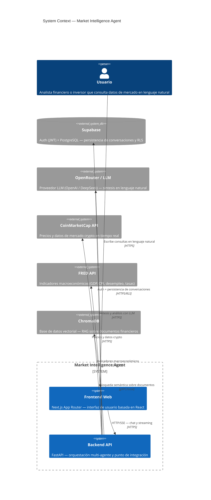
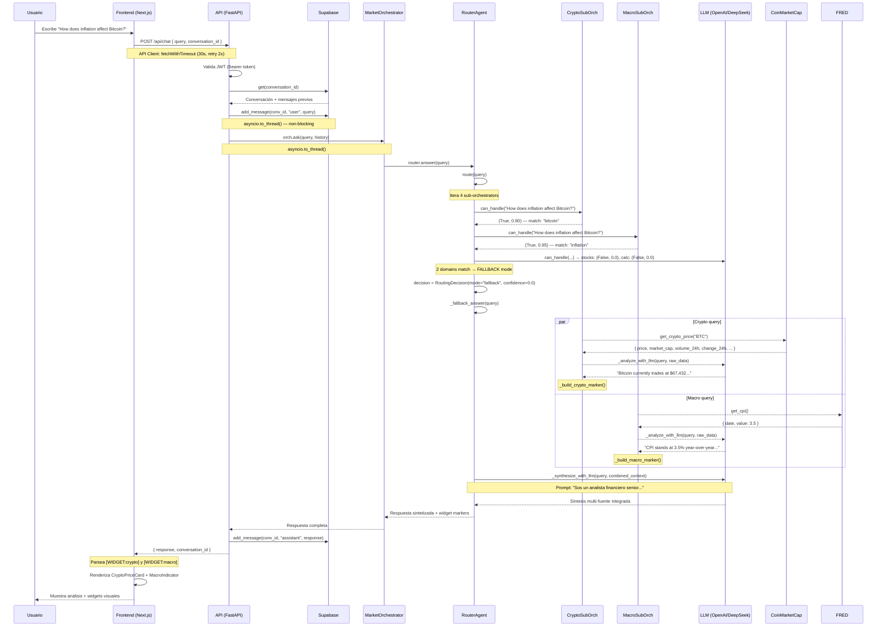

# Market Intelligence Agent — Architecture

> **Documento de Arquitectura basado en el Modelo C4**
> *Última actualización: 2026-05-15*
> *Público objetivo: Arquitectos, desarrolladores senior, DevOps, CTO*

---

## Índice

1. [Contexto del Sistema (C1)](#1-context-diagram-c1)
2. [Diagrama de Contenedores (C2)](#2-container-diagram-c2)
3. [Diagrama de Componentes (C3)](#3-component-diagram-c3)
4. [Flujo de Datos — Consulta Multi-Agente](#4-data-flow-consulta-multi-agente)
5. [Decisiones Arquitectónicas Clave](#5-decisiones-arquitectónicas-clave)

---

## 1. Context Diagram (C1)

El sistema es una plataforma de inteligencia de mercados financieros que permite a usuarios institucionales y minoristas realizar consultas en lenguaje natural sobre criptomonedas, macroeconomía, acciones y cálculos financieros. El frontend web se comunica con un backend FastAPI, que a su vez orquesta múltiples agentes especializados y fuentes de datos externas.



### Capas del Contexto

| Capa | Rol |
|------|-----|
| **Usuario** | Analista o inversor que escribe preguntas en lenguaje natural (multi-idioma). No necesita saber SQL ni APIs. |
| **Frontend** | Aplicación Next.js con App Router, Tailwind CSS y shadcn/ui. Proporciona chat en tiempo real con streaming SSE, widgets visuales (crypto prices, macro indicadores, tablas de datos) y autenticación delegada a Supabase Auth. |
| **Backend** | API REST+SSE construida con FastAPI. Es el cerebro del sistema: orquesta agentes especializados, gestiona sesiones de usuario y provee datos estructurados + análisis LLM. |
| **Supabase** | Doble función: (1) **Auth** — manejo de sesiones JWT con Row-Level Security para aislamiento entre usuarios; (2) **PostgreSQL** — almacenamiento persistente de conversaciones y mensajes con consultas asíncronas via `asyncio.to_thread()`. |
| **OpenRouter / LLM** | Proveedor de modelo de lenguaje (OpenAI o DeepSeek vía interfaz compatible). Se usa para: clasificación de intención, síntesis multi-fuente, y análisis con tono ejecutivo. |
| **CoinMarketCap** | API REST para datos en tiempo real de criptomonedas: precio, capitalización, volumen, dominancia, ranking. |
| **FRED (Federal Reserve)** | Datos macroeconómicos oficiales: GDP, CPI, tasa de desempleo, tasa de fondos federales, rendimientos del tesoro. |
| **ChromaDB** | Base de datos vectorial local para RAG (Retrieval-Augmented Generation) sobre documentos financieros históricos, noticias y análisis de sentimiento. |

---

## 2. Container Diagram (C2)

```mermaid
C4Container
  title Container Diagram — Market Intelligence Agent

  Person(user, "Usuario", "Analista financiero")

  System_Boundary(frontend_containers, "Frontend Web (Next.js)") {
    Container(app_router, "Next.js App Router", "React Server Components + Client Components", "Ruteo, layouts, SSR de landing page")
    Container(chat_ui, "Chat UI", "React Client Components", "Streaming de mensajes, widgets de datos, sidebars")
    Container(auth_ui, "Auth Module", "Supabase Auth + Next.js Middleware", "Login, signup, callback OAuth, protección de rutas")
    Container(api_client, "API Client", "TypeScript fetch wrapper", "Timeout 30s, retry 2x, refresh de token 401")
    Container(zustand_stores, "Zustand Stores", "Estado global cliente", "chatStore, authStore — estado reactivo")
  }

  System_Boundary(backend_containers, "Backend (FastAPI)") {
    Container(fastapi, "FastAPI App", "Python FastAPI", "REST endpoints + SSE streaming + middleware CORS/GZip/logging")
    Container(auth_backend, "Auth Backend", "JWT Validator + Supabase Client", "Validación local de JWT con `pyjwt`, sin depender de Supabase Auth HTTP")
    Container(chat_routes, "Chat Routes", "FastAPI Router", "POST /api/chat — Q&A | GET /api/chat/stream — SSE streaming")
    Container(conversation_store, "SupabaseConversationStore", "Supabase PostgreSQL + asyncio.to_thread()", "CRUD de conversaciones por usuario con RLS, auto-titulado de conversaciones")
    Container(market_orchestrator, "MarketOrchestrator", "Singleton — inicializado en lifespan", "Orquestador jeŕarquico multi-mercado")
  }

  System_Boundary(agent_layer, "Agent Layer") {
    Container(router_agent, "RouterAgent", "Python", "Clasifica la consulta y la rutea al sub-orchestrator adecuado")
    Container(crypto_sub, "CryptoSubOrchestrator", "Python + LLM", "Datos crypto via CoinMarketCap + análisis LLM")
    Container(macro_sub, "MacroSubOrchestrator", "Python + LLM", "Indicadores macro via FRED + análisis LLM")
    Container(stocks_sub, "StocksSubOrchestrator", "Python + LangChain", "RAG sobre ChromaDB para acciones/equities")
    Container(calc_exec, "CalculationExecutor", "Python REPL + NumPy/Pandas", "Cálculos financieros (NPV, Sharpe, SMA) via Python sanitizado")
  }

  SystemDb_Ext(supabase_db, "Supabase", "PostgreSQL + Auth")
  System_Ext(cmc_api, "CoinMarketCap", "API REST")
  System_Ext(fred_api, "FRED", "API REST")
  System_Ext(llm_api, "OpenAI / DeepSeek", "API LLM")
  SystemDb_Ext(chroma, "ChromaDB", "Vector DB local")

  Rel(user, app_router, "Navega", "HTTPS")
  Rel(app_router, chat_ui, "Renderiza", "RSC + Client Islands")
  Rel(chat_ui, api_client, "Llama", "import")
  Rel(api_client, fastapi, "HTTP POST/GET + SSE", "HTTPS + Bearer JWT")
  Rel(api_client, auth_ui, "Refresh token", "Supabase Auth")

  Rel(fastapi, auth_backend, "Valida", "Depends()")
  Rel(fastapi, chat_routes, "Delega", "FastAPI Router")
  Rel(chat_routes, conversation_store, "Persiste", "asyncio.to_thread")
  Rel(chat_routes, market_orchestrator, "ask() / ask_stream()", "asyncio.to_thread")
  Rel(conversation_store, supabase_db, "CRUD", "HTTPS + RLS")

  Rel(market_orchestrator, router_agent, "route() + answer()", "Python directo")
  Rel(router_agent, crypto_sub, "Delega", "sub.answer(query)")
  Rel(router_agent, macro_sub, "Delega", "sub.answer(query)")
  Rel(router_agent, stocks_sub, "Delega", "sub.answer(query)")
  Rel(router_agent, calc_exec, "Delega", "sub.answer(query)")
  Rel(router_agent, llm_api, "Síntesis multi-fuente", "LangChain (ChatOpenAI)")

  Rel(crypto_sub, cmc_api, "GET /cryptocurrency/quotes/latest", "HTTPS + API Key")
  Rel(macro_sub, fred_api, "GET /fred/series/observations", "HTTPS + API Key")
  Rel(stocks_sub, chroma, "query() — búsqueda semántica", "ChromaDB local")
  Rel(stocks_sub, llm_api, "Análisis ejecutivo", "LangChain (ChatOpenAI)")
  Rel(crypto_sub, llm_api, "Análisis ejecutivo", "LangChain (ChatOpenAI)")
  Rel(macro_sub, llm_api, "Análisis ejecutivo", "LangChain (ChatOpenAI)")
  Rel(calc_exec, chroma, "get_recent_history()", "Solo contexto histórico")

  UpdateLayoutConfig($c4ShapeInRow="2", $c4BoundaryInRow="1")
```



### Descripción de Contenedores

#### Frontend (Next.js)

| Contenedor | Tecnología | Responsabilidad |
|------------|-----------|----------------|
| **App Router** | React Server Components + Client Components | Ruteo (chat, login, signup), layout global, metadata SEO |
| **Chat UI** | `chat/page.tsx`, `ChatInput`, `MessageList`, `ConversationHistory` | Streaming de tokens via SSE, renderizado de widgets (CryptoPriceCard, MacroIndicator, CalcResult, DataTable) |
| **Auth Module** | Supabase Auth SSR + Middleware | Login/signup con email, callback OAuth, redirección post-auth, middleware para rutas protegidas |
| **API Client** | `api.ts` — wrapper con timeout (30s), retry (2x), refresh automático de JWT en 401 | Capa de transporte única para todas las llamadas al backend |
| **Zustand Stores** | `chatStore`, `authStore` | Estado reactivo del chat (mensajes, streaming, conversación activa) y autenticación |

#### Backend (FastAPI)

| Contenedor | Tecnología | Responsabilidad |
|------------|-----------|----------------|
| **FastAPI App** | FastAPI + lifespan | Application factory, middleware CORS/GZip/logging, registro de routers, manejador global de excepciones |
| **Auth Backend** | `jwt_validator.py` + `supabase_client.py` | Validación local de JWT con `pyjwt` (sin depender de Supabase Auth HTTP por latencia), cliente Supabase singleton |
| **Chat Routes** | `routes/chat.py` | Endpoint POST `/api/chat` (Q&A síncrono) y GET `/api/chat/stream` (SSE streaming) |
| **SupabaseConversationStore** | `state.py` — `SupabaseConversationStore` | CRUD sobre tablas `conversations` y `messages` con RLS, auto-titulado, bulk counting (solución a N+1) |
| **MarketOrchestrator** | `orchestrator.py` — `MarketOrchestrator` | Singleton inicializado en lifespan. Registra los 4 sub-orchestrators, health check de MCPs al startup |

#### Agent Layer

| Contenedor | Tecnología | Responsabilidad |
|------------|-----------|----------------|
| **RouterAgent** | `router_agent.py` — `RouterAgent` | Clasifica la consulta por dominio (crypto, macro, stocks, calculation) usando keyword matching + threshold de confianza. Si hay 2+ dominios → fallback (consulta paralela + síntesis LLM). Si confianza < 0.7 → fallback |
| **CryptoSubOrchestrator** | `crypto_sub.py` — `CryptoSubOrchestrator` | Llama al MCP de CoinMarketCap para precio, top cryptos o métricas globales. Pasa datos crudos por LLM para análisis ejecutivo. Genera widget marker `[WIDGET:crypto]{json}[/WIDGET]` |
| **MacroSubOrchestrator** | `macro_sub.py` — `MacroSubOrchestrator` | Llama al MCP de FRED (GDP, CPI, desempleo, tasas, treasury yields). Pasa datos crudos por LLM para análisis. Genera widget marker `[WIDGET:macro]{json}[/WIDGET]` |
| **StocksSubOrchestrator** | `stocks_sub.py` — `StocksSubOrchestrator` | Wrapper sobre el `MarketQueryAgent` existente. Hace RAG sobre 3 colecciones de ChromaDB (stocks, news, sentiment) y genera análisis ejecutivo con LLM |
| **CalculationExecutor** | `python_repl.py` — `CalculationExecutor` | Ejecuta cálculos financieros (NPV, Sharpe Ratio, SMA) usando un sandbox Python con NumPy/Pandas. Genera widget marker `[WIDGET:calc]{json}[/WIDGET]`. Soporta recuperación de historial cross-session |

---

## 3. Component Diagram (C3)

```mermaid
C4Component
  title Component Diagram — Agent Layer Internals

  Container_Boundary(router, "RouterAgent") {
    Component(route_method, "route()", "Python", "Clasifica query vía keyword matching sobre cada sub-orchestrator")
    Component(answer_method, "answer()", "Python", "Direct route → delega | Fallback → consulta paralela + síntesis")
    Component(synthesize, "_synthesize_with_llm()", "LangChain + ChatOpenAI", "Prompt de síntesis multi-fuente con tono ejecutivo")
    Component(decide, "RoutingDecision", "Dataclass", "mode=direct|fallback, sub_orchestrator, confidence")
  }

  Container_Boundary(crypto, "CryptoSubOrchestrator") {
    Component(can_handle_crypto, "can_handle()", "25 keywords", "bitcoin, eth, sol, crypto, blockchain, defi, etc.")
    Component(get_crypto_data, "_get_crypto_data()", "Lazy import", "Delega al MCP según detección de intención")
    Component(mcp_crypto, "MCP: crypto_server.py", "FastMCP + httpx", "get_crypto_price, get_top_cryptos, get_crypto_global_metrics")
    Component(cmc_api_call, "CoinMarketCap REST", "httpx.Client()", "GET /cryptocurrency/quotes/latest")
    Component(analyze_crypto, "_analyze_with_llm()", "LangChain + ChatOpenAI", "Prompt de analista crypto — datos crudos → análisis ejecutivo")
    Component(widget_crypto, "_build_crypto_marker()", "Regex parser", "Extrae symbol, price, change24h, marketCap → [WIDGET:crypto]{json}")
  }

  Container_Boundary(macro, "MacroSubOrchestrator") {
    Component(can_handle_macro, "can_handle()", "17 keywords", "gdp, inflation, unemployment, fed rate, treasury, etc.")
    Component(get_macro_data, "_get_macro_data()", "Lazy import", "Delega al MCP según detección de intención")
    Component(mcp_macro, "MCP: macro_server.py", "FastMCP + httpx", "_fetch_series — GDP, CPI, UNRATE, FEDFUNDS, DGS10, DGS2")
    Component(fred_api_call, "FRED REST", "httpx.Client()", "GET /fred/series/observations?series_id=X")
    Component(analyze_macro, "_analyze_with_llm()", "LangChain + ChatOpenAI", "Prompt de economista senior — datos crudos → análisis ejecutivo")
    Component(widget_macro, "_build_macro_marker()", "Regex parser", "Extrae indicator, date, value, unit → [WIDGET:macro]{json}")
  }

  Container_Boundary(stocks, "StocksSubOrchestrator") {
    Component(can_handle_stocks, "can_handle()", "15 keywords", "stock, equity, aapl, msft, nvda, rsi, pe ratio, etc.")
    Component(get_agent, "_get_agent()", "Lazy init", "Crea MarketQueryAgent con retriever")
    Component(query_agent, "MarketQueryAgent", "LangChain ReAct", "Pipeline: retrieve_raw_data → generate_analysis")
    Component(retriever, "MarketRAGRetriever", "ChromaDB + sentence-transformers", "3 colecciones: market_stocks, market_news, market_sentiment")
    Component(chroma_stocks, "ChromaDB Collection", "market_stocks", "Datos históricos de precios, volumen, fundamentales")
    Component(chroma_news, "ChromaDB Collection", "market_news", "Noticias financieras procesadas")
    Component(chroma_sentiment, "ChromaDB Collection", "market_sentiment", "Análisis de sentimiento por ticker")
    Component(memory, "ConversationMemory", "In-memory", "Historial de la conversación actual")
    Component(cache, "SemanticCache", "ChromaDB + embedding", "Caché de queries semánticamente similares (threshold 0.85)")
  }

  Container_Boundary(calc, "CalculationExecutor") {
    Component(can_handle_calc, "can_handle()", "18 keywords", "npv, irr, sharpe, volatility, correlation, moving average, etc.")
    Component(calc_npv, "_calculate_npv()", "Python REPL", "Código Python con NumPy — NPV + interpretación")
    Component(calc_sharpe, "_calculate_sharpe()", "Python REPL", "Sharpe Ratio con ejemplo de returns diarios")
    Component(calc_sma, "_calculate_sma()", "Python REPL + Pandas", "Simple Moving Average con ejemplo de precios")
    Component(mcp_repl, "MCP: repl_server.py", "FastMCP + subprocess", "Ejecuta Python en sandbox, captura stdout")
    Component(widget_calc, "_build_calc_marker()", "JSON builder", "Extrae formula, result, interpretation → [WIDGET:calc]{json}")
    Component(history, "get_recent_history()", "Async — Supabase query", "Últimas N conversaciones del usuario para contexto cross-session")
  }

  Rel(route_method, can_handle_crypto, "Itera", "can_handle(query)")
  Rel(route_method, can_handle_macro, "Itera", "can_handle(query)")
  Rel(route_method, can_handle_stocks, "Itera", "can_handle(query)")
  Rel(route_method, can_handle_calc, "Itera", "can_handle(query)")
  Rel(answer_method, decide, "Crea", "")
  Rel(answer_method, synthesize, "En fallback", "query + resultados de todos los subs")
  Rel(synthesize, llm_api, "Prompt de síntesis", "")

  Rel(get_crypto_data, mcp_crypto, "Llama función", "")
  Rel(mcp_crypto, cmc_api_call, "HTTP GET", "")
  Rel(analyze_crypto, llm_api, "Datos crudos → análisis", "")
  Rel(widget_crypto, get_crypto_data, "Parsea raw_data", "")

  Rel(get_macro_data, mcp_macro, "Llama función", "")
  Rel(mcp_macro, fred_api_call, "HTTP GET", "")
  Rel(analyze_macro, llm_api, "Datos crudos → análisis", "")
  Rel(widget_macro, get_macro_data, "Parsea raw_data", "")

  Rel(get_agent, query_agent, "Crea", "")
  Rel(query_agent, retriever, "query_all()", "")
  Rel(retriever, chroma_stocks, "similarity_search", "ChromaDB")
  Rel(retriever, chroma_news, "similarity_search", "ChromaDB")
  Rel(retriever, chroma_sentiment, "similarity_search", "ChromaDB")
  Rel(query_agent, memory, "add/context", "")
  Rel(query_agent, cache, "get/set", "Semantic cache")
  Rel(query_agent, llm_api, "Análisis ejecutivo", "")

  Rel(calc_npv, mcp_repl, "calculate_python(code)", "subprocess")
  Rel(calc_sharpe, mcp_repl, "calculate_python(code)", "subprocess")
  Rel(calc_sma, mcp_repl, "calculate_python(code)", "subprocess")
  Rel(widget_calc, calc_npv, "Parsea resultado", "")
  Rel(widget_calc, calc_sharpe, "Parsea resultado", "")
  Rel(widget_calc, calc_sma, "Parsea resultado", "")

  UpdateLayoutConfig($c4ShapeInRow="2", $c4BoundaryInRow="1")
```

### Componentes por Sub-Orquestador

#### RouterAgent
- **`route(query)`**: Itera todos los sub-orchestrators registrados llamando a `can_handle()`. Si 2+ matchean → `fallback`. Si 1 match con confianza ≥ 0.7 → `direct`. Si confianza < 0.7 → `fallback`.
- **`answer(query)`**: Si `direct` → delega al sub-orchestrator ganador. Si `fallback` → ejecuta `_fallback_answer()` que consulta TODOS los sub-orchestrators y sintetiza con LLM.
- **`_synthesize_with_llm(query, context)`**: Prompt específico para que el LLM integre datos de múltiples fuentes (CoinMarketCap, FRED, ChromaDB) en una respuesta ejecutiva coherente. Usa `ChatOpenAI` con temperature 0.3.

#### CryptoSubOrchestrator
- Detección vía 25 keywords (bitcoin, eth, sol, crypto, blockchain, defi, etc.).
- Tres modos de consulta: precio de moneda específica, top cryptos, métricas globales.
- MCP implementado con `FastMCP` sobre `httpx`, llamando a `pro-api.coinmarketcap.com/v1`.
- Post-procesamiento: LLM convierte datos crudos en análisis narrativo + widget JSON para el frontend.

#### MacroSubOrchestrator
- Detección vía 17 keywords (gdp, inflation, unemployment, fed rate, treasury, etc.).
- MCP implementado con `FastMCP` sobre `httpx`, llamando a `api.stlouisfed.org/fred/series/observations`.
- Series disponibles: GDP (GDP), CPI (CPIAUCSL), Unemployment (UNRATE), Fed Funds (FEDFUNDS), 10y Yield (DGS10), 2y Yield (DGS2).
- Post-procesamiento: LLM + widget `[WIDGET:macro]` con indicator, date, value, unit.

#### StocksSubOrchestrator
- Detección vía 15 keywords (stock, equity, aapl, msft, nvda, rsi, pe ratio, etc.).
- Wrapper transparente sobre el `MarketQueryAgent` original — 0 cambios al pipeline legacy.
- RAG sobre 3 colecciones ChromaDB: `market_stocks`, `market_news`, `market_sentiment`.
- Pipeline: `retrieve_raw_data()` → `_generate_analysis()` con `build_analysis_prompt()` (sin artifacts ReAct).
- Capa de defensa: `_strip_data_sections()` y `_strip_react_artifacts()` para evitar que datos crudos lleguen al usuario.
- Caché semántico: ChromaDB como backend con threshold de similitud 0.85.
- Soporte multi-idioma: detección vía `langdetect` + keyword fallback para 55+ idiomas.

#### CalculationExecutor
- Detección vía 18 keywords (npv, irr, sharpe, volatility, correlation, etc.).
- Ejecuta Python en sandbox via `subprocess` (MCP `repl_server.py`).
- Templates: NPV (flujos de caja + descuento), Sharpe Ratio (rendimiento diario → anualizado), SMA (ventana 5 y 10 con Pandas).
- Widget `[WIDGET:calc]` con formula, result, interpretation.
- `get_recent_history()`: recupera últimas N conversaciones del usuario desde Supabase para contexto cross-session.

---

## 4. Data Flow — Consulta Multi-Agente

A continuación se describe el flujo completo de una consulta multi-dominio, usando como ejemplo:

> **"How does inflation affect Bitcoin?"**

Esta consulta activa **2 dominios**: `macro` (inflation) y `crypto` (Bitcoin), lo que dispara el modo `fallback` del RouterAgent.



### Etapas del Flujo

| Etapa | Duración típica | Descripción |
|-------|----------------|-------------|
| **1. Envío Frontend** | ~50ms | `useChat().sendMessage()` → `api.chat.stream()`. Timeout global de 30s con 2 retries. |
| **2. Validación + Persistencia** | ~200ms | FastAPI valida JWT localmente (sin HTTP a Supabase Auth). Guarda mensaje del usuario en PostgreSQL via `asyncio.to_thread()`. |
| **3. Ruteo** | <5ms | `RouterAgent.route()` itera 4 sub-orchestrators con keyword matching O(1). Cada `can_handle()` es un loop de strings. |
| **4. Consulta Paralela** | ~1-3s | Los sub-orchestrators matcheados ejecutan en serie dentro del mismo thread. Crypto llama a CoinMarketCap (HTTP), Macro llama a FRED (HTTP). |
| **5. Análisis LLM por dominio** | ~2-5s | Cada sub-orchestrator con datos crudos llama a su propio LLM para convertir en análisis narrativo. Temperatura 0.3 para balance entre precisión y variación. |
| **6. Síntesis Multi-Fuente** | ~2-4s | Un LLM separado (o el mismo) integra los análisis parciales en una respuesta ejecutiva coherente. Prompt específico de "analista financiero senior". |
| **7. Widget Markers** | <10ms | Cada sub-orchestrator parsea sus datos crudos con regex y genera JSON estructurado envuelto en `[WIDGET:dominio]{...}[/WIDGET]`. |
| **8. Renderizado Frontend** | ~100ms | `widgetParser.ts` detecta markers en el texto, `WidgetRenderer` instancia el componente React correspondiente (CryptoPriceCard, MacroIndicator, CalcResult, DataTable). |

### Casos Especiales

| Situación | Comportamiento |
|-----------|---------------|
| **Timeout de API externa** | El MCP captura `httpx.TimeoutException` y devuelve mensaje user-friendly. El RouterAgent captura `Exception` en `_fallback_answer()` y marca como "Datos no disponibles temporalmente". |
| **LLM no configurado** | Cada sub-orchestrator tiene fallback: si no hay API key, devuelve los datos crudos sin análisis. El `MarketQueryAgent` usa `_format_output()` genérico. |
| **401 en JWT** | `api.ts` en frontend atrapa 401 → `refreshAndRetry()` → refresca sessión de Supabase → reintenta la request con nuevo token. Si falla de nuevo, muestra "Sesión expirada". |
| **Consulta multi-idioma** | `detect_language()` en `MarketQueryAgent` usa `langdetect` con fallback keyword para 55+ idiomas. Todos los prompts y respuestas se adaptan al idioma detectado. |
| **Multi-dominio** | Si 2+ dominios matchean → fallback automático. Todos los sub-orchestrators consultados en paralelo → síntesis LLM. |
| **Caché semántico** | Si la consulta es semánticamente similar (≥0.85) a una previa, devuelve resultado cacheado. Caché con TTL de 24h. |

---

## 5. Decisiones Arquitectónicas Clave

### ADR-01: RouterAgent con Fallback en vez de clasificador LLM

**Contexto**: Necesitábamos clasificar consultas en dominios (crypto, macro, stocks, calculation).

**Decisión**: Usar keyword matching con confianza numérica en vez de un LLM para el ruteo.

**Razón**: El keyword matching en `can_handle()` es O(n·m) con n=dominios y m=keywords por dominio. Se ejecuta en <5ms. Un LLM agregaría 2-5s de latencia y costo por consulta antes siquiera de empezar a procesar.

**Tradeoff**: El matching es menos flexible (no entiende sinónimos complejos), pero el fallback multi-dominio captura los casos ambiguos.

### ADR-02: MCPs como funciones (no servidores HTTP)

**Contexto**: Las integraciones con CoinMarketCap y FRED.

**Decisión**: Implementar MCPs como funciones Python con `FastMCP` + `httpx`, importadas lazy, en vez de servidores HTTP separados.

**Razón**: Para un equipo pequeño, mantener servidores MCP independientes agrega complejidad operativa innecesaria. Las funciones lazy-loaded se importan ~1.4s en el primer uso y luego quedan en memoria.

**Tradeoff**: No hay despliegue independiente ni escalado vertical separado. Si un MCP falla, afecta al proceso principal.

### ADR-03: Widget Markers como protocolo Frontend-Backend

**Contexto**: El backend produce análisis LLM en texto plano, pero el frontend necesita mostrar datos estructurados (precios, tablas, indicadores).

**Decisión**: Los sub-orchestrators incrustan markers `[WIDGET:dominio]{json}[/WIDGET]` al final del texto de respuesta. El frontend los parsea con regex y renderiza componentes React.

**Razón**: Permite que el backend evolucione independientemente del frontend. No se necesita un endpoint separado para datos estructurados. Si el widget marker no se puede construir, el texto plano sigue siendo válido.

### ADR-04: BaseSubOrchestrator como interfaz común

**Contexto**: 4 dominios diferentes con implementaciones muy distintas (HTTP API, ChromaDB RAG, Python REPL).

**Decisión**: Una clase base abstracta `BaseSubOrchestrator` con 3 métodos: `domain` (property), `can_handle(query)` → `(bool, float)`, `answer(query)` → `str`.

**Razón**: Permite que el `RouterAgent` trate a todos los sub-orchestrators de manera uniforme. Agregar un nuevo dominio (ej. forex, commodities) requiere solo crear una nueva subclase y registrarla.

### ADR-05: Supabase para Auth + Persistencia unificados

**Contexto**: Necesitábamos autenticación y almacenamiento persistente.

**Decisión**: Usar Supabase para ambos: Auth (JWT con RLS) y PostgreSQL (conversaciones + mensajes).

**Razón**: Un solo proveedor reduce complejidad operativa. RLS asegura aislamiento entre usuarios a nivel BD. `asyncio.to_thread()` evita bloquear el event loop de FastAPI.

**Tradeoff**: Dependencia de un solo proveedor. Las queries a Supabase desde Python requieren `asyncio.to_thread()`, lo que agrega overhead de thread pool.

### ADR-06: ChromaDB local para RAG en vez de servicio externo

**Contexto**: Necesitábamos búsqueda semántica sobre documentos financieros.

**Decisión**: ChromaDB embebida localmente con `sentence-transformers/all-MiniLM-L6-v2`.

**Razón**: Sin dependencia de red, sin costo por query, sin latencia de servicio externo. Datos financieros sensibles no salen del servidor.

**Tradeoff**: Escalabilidad limitada al disco local. No hay replicación ni alta disponibilidad sin configurarlo manualmente.
